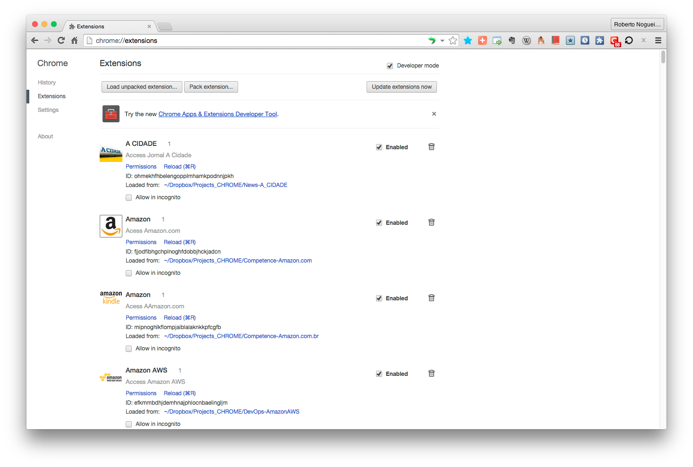
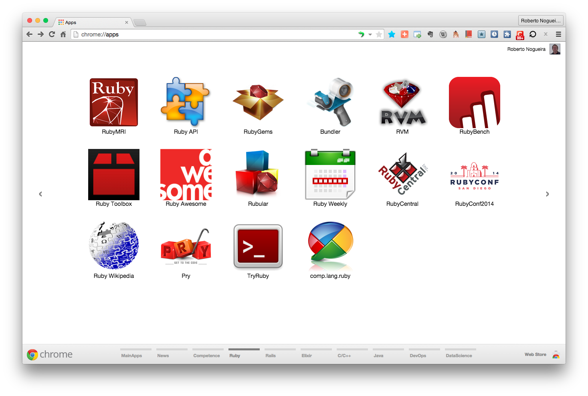

# Chrome Apps for Ruby


## Installation

### 1. Clone this repository and see its contents.
Open a terminal give the following command:

```bash
$ git clone https://github.com/enogrob/ChromeApps_Ruby.git
```

As we can see a subdirectory is created for each Ruby app.

```bash
$ ls -la
total 40
drwxr-xr-x@   8 enogrob  staff   272B Apr  1 16:24 ./
:
drwxr-xr-x   28 enogrob  staff   952B Apr  1 16:35 ChromeApss_Ruby/
-rw-r--r--    1 enogrob  staff   137B Apr  1 16:24 today_data.yaml

$ tree -L 1 ChromeApps_Ruby/
ChromeApps_Ruby
├── README.md
├── Ruby-API
├── Ruby-APIdock
├── Ruby-Homepage
├── Ruby-Pry
├── Ruby-RVM
├── Ruby-Rails
├── Ruby-RubyGems
├── Ruby-RubyInside
├── Ruby-Toolbox
├── Ruby-Wiki
└── images

23 directories, 1 file
[TODAY (master)]$
:
$
```

### 2. Open Chrome with the following url:
In order to load the `Chrome Apps` for Ruby, check `Developer Mode` and press `Load unpacked extension...` to load each App selecting its corresponding directory inside `ChromeApps_Ruby` e.g. `Ruby-MRI`, and then repeat that for the other apps.

```
chrome://extensions/
```



### 3. After load all the Chrome Apps for Ruby, Chrome will look like the screenshot below:

